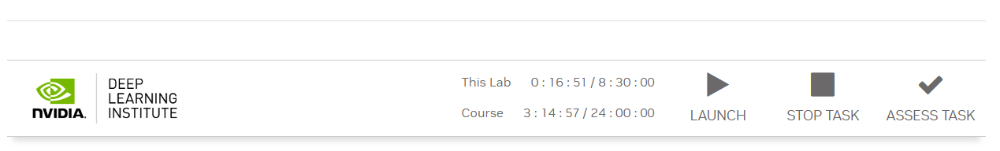

# NVIDIA-DLI-Certificate
NVIDIA Deep Learning Institue(DLI) Certificate Answers(pytorch) 英伟达深度学习基础-拿认证速通版(pytorch版本)

网上大多都是几年前的tensorflow版本，故传一份新版本pytorch的手搓代码。速通拿证书。

**使用过程：**

+ 下载代码
+ 把`utils.py`和`07_assessment.ipynb`复制进jupyterlab里，选择覆盖文件
+ 运行`07_assessment.ipynb`
+ 回到启动界面，点击**ASSESS TASK**

结束。

Since most online resources are outdated and based on older versions of TensorFlow, I've uploaded a new version of PyTorch code that you can manually create. This is for quickly obtaining the certificate.

**Usage Process:**

- Download the code
- Copy `utils.py` and `07_assessment.ipynb` into JupyterLab, selecting to overwrite the files
- Run `07_assessment.ipynb`
- Return to the startup interface and click on **ASSESS TASK**

